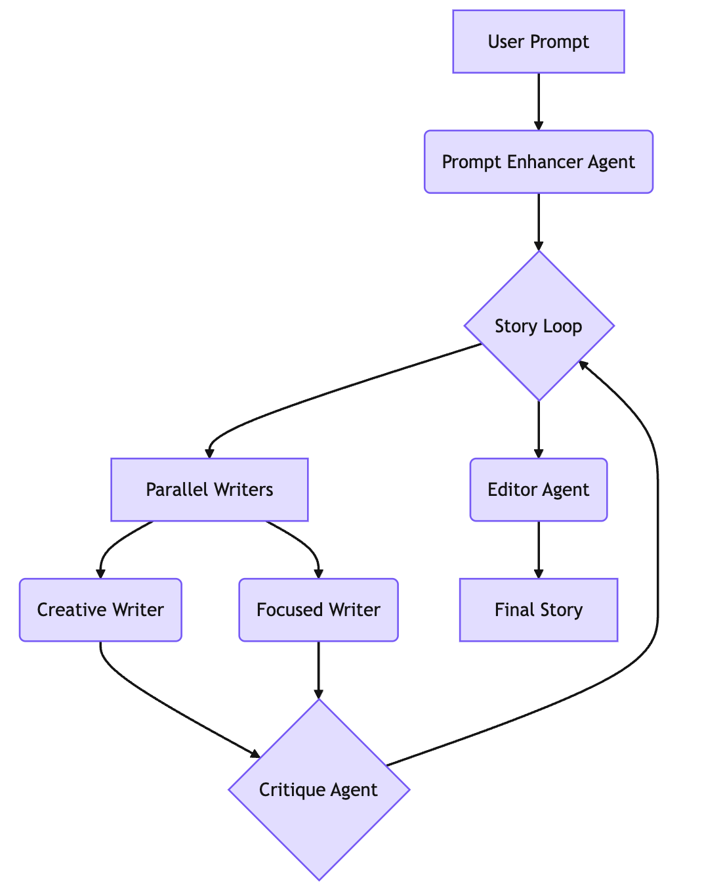

# Story Teller Agent

## Overview

The Story Teller Agent is multi-agent system designed for collaborative story writing. This is a simple, yet powerful, multi-agent ADK sample that takes a user prompt and transforms it into a complete, multi-chapter story. The agent leverages a team of specialized AI agents, each with a unique role, to brainstorm, draft, critique, and edit the story, showcasing a sphisticated workflow for creatrive content generation.

## Agent Architecture

This agent uses a sequential workflow that orchestrates several sub-agents to produce a story. The process is as follows:

1. **Prompt Enhancer:** Takes a basic user idea and expands into a detailed premise, setting the stage for the story.
2. **Story Loop:** This is the core of the writing process, which iterates for a predefined number of chapters:
    *   **Paraller Writers:** Whithin the loop, two writer agents, a `Creative Writer` and a `Focused Writer` simultanously create two different versions of the next chapter. The `Creative Writer` uses a high temperature for more imaginative and unpredictable results, while the `Focused Writer` uses a low temperature for more logical and consistent writing.
    *   **Critique Agent:** This agent reviews the two chapter draft and selects the one that best fits the story's premise and narrative arc.
3. **Edit Agent:** Once all chapeters are written, the `Edito Agent` performs a final review of the entire story, polishing it for a grammar, flow, and consistensy.

  

